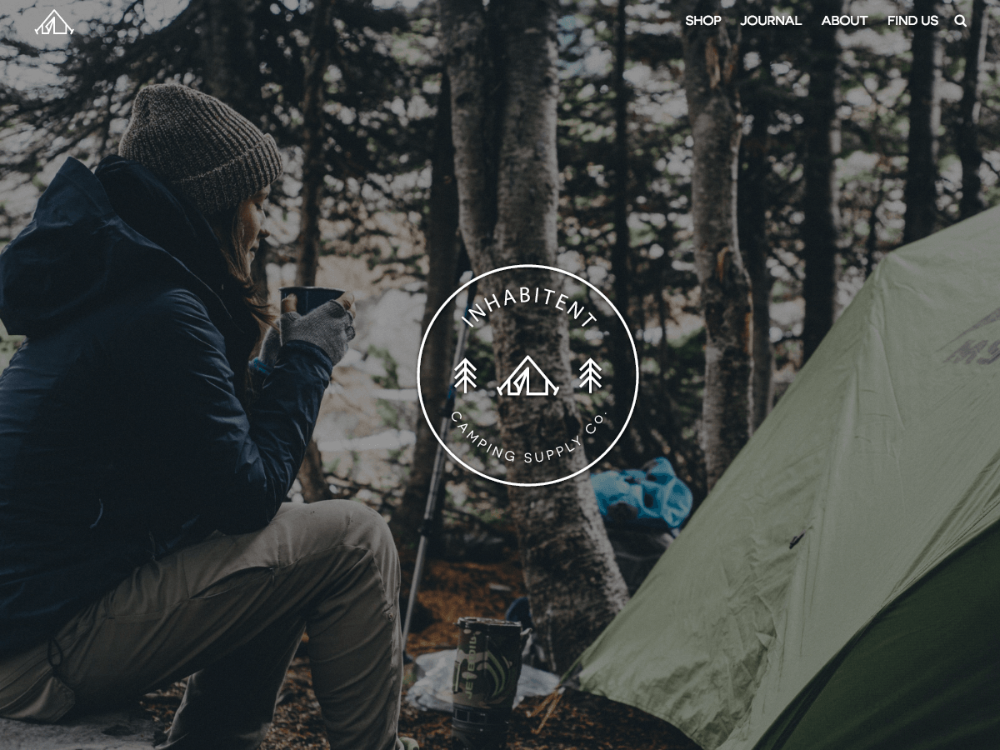

## Project 4: Inhabitent 

## Description
This dynamic multi-page website is using WordPress for the content managment system. The site includes a display of camping products. 

## Technology
* WordPress
* Git/Github
* Sass (http://sass-lang.com/)
* PHP
* jQuery (https://jquery.com/)

## Developers Dependencies
* BrowserSync (https://www.browsersync.io/)
* Gulp

## Learning Experience
This is the biggest project I ever worked on so far. I've built this theme from scratch using a starter theme. This is the first time I made wordpress site with plugins or custom post types. I've created a Business Hours and Contact Info plugins which allows the users to set up their own opening hours and contact information. Once those are done, I've created customized Adventures and Shopping post types. My Sass skills were honed working on this project as there were a lot of it involved.

This project wasn't originally designed to be responsive because of time constraints.

As a camping fan, this is my favorite project so far and I'm very proud of it.
